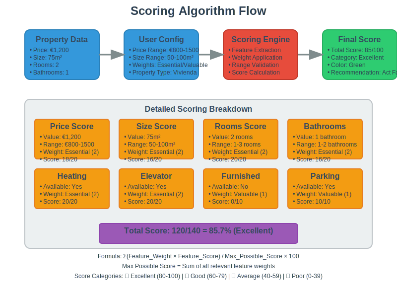

# Idea-lista Chrome Extension

A professional Chrome extension that transforms your Idealista property search experience with automatic analysis, intelligent scoring, and comprehensive property management using the Idea-lista system.

## 🏠 Overview

**Idea-lista** is not just an analyzer—it's your complete property search assistant. It automatically extracts data from Idealista listings, calculates professional scores based on real estate criteria, and helps you manage, compare, and organize your property search efficiently.


*The Property Manager uses a sophisticated architecture with content scripts for data extraction, background scripts for scoring and storage, and a popup interface for property management.*

## ✨ Key Features

### 🎯 **Professional Property Analysis**
- **Automatic Data Extraction**: Extracts 15+ data points from every listing
- **Intelligent Scoring System**: Professional algorithm that ranks properties (0-100)
- **Real-time Analysis**: Instant evaluation as you browse

### 🎨 **Smart Visual Interface**
- **Color-Coded Quality Indicators**:
  - 🟢 **Excellent (80-100)**: Outstanding properties
  - 🔵 **Good (60-79)**: Very good options  
  - 🟡 **Average (40-59)**: Decent properties
  - 🔴 **Poor (0-39)**: Below average
- **Compact Design**: Optimized for efficient browsing
- **Responsive Layout**: Works perfectly on all screen sizes

### 💾 **Property Management System**
- **Save & Organize**: Add properties to your personal collection
- **Smart Sorting**: Automatically ordered by score (best first)
- **Quick Actions**: View, remove, and manage properties instantly
- **Persistent Storage**: Your data stays safe between sessions

### 📊 **Advanced Comparison Tools**
- **Best Property Analysis**: Click "🏆 Mejor" to see why a property is the best
- **Detailed Advantages**: Professional breakdown of property strengths
- **Comparative Insights**: See how properties stack up against each other

### 📋 **Export & Import**
- **One-Click Export**: Download all data as TSV file
- **Score-Sorted Export**: Properties ordered from best to worst score
- **Import Functionality**: Import properties from TSV/CSV files
- **Duplicate Prevention**: Automatically avoids importing duplicate properties
- **Excel-Ready Format**: Perfect for further analysis
- **Complete Data Set**: All extracted information included
- **Position Ranking**: Includes position column for easy reference

## 🔍 Extracted Information

### **Core Property Data**
- Price (€/month) and price per m²
- Square meters and room count
- Bathrooms and floor number
- Orientation and energy certificate
- **GPS Coordinates**: Latitude and longitude with Google Maps integration

### **Features & Amenities**
- Heating availability
- Furnished status
- Elevator access
- Seasonal vs. long-term rental

### **Contact & Details**
- Professional/Private advertiser
- Phone number
- Last update date
- Property ID and URL
- **Coordinates & Location**: GPS coordinates with direct Google Maps links

### **Smart Analysis**
- Months mentioned in descriptions
- Deposit information
- Professional scoring (0-100)

## 🧠 Professional Scoring Algorithm

Our scoring system is based on real estate industry standards:



*The scoring algorithm combines multiple factors with professional weights to provide objective property evaluation.*

### **Price Analysis (25% weight)**
- Lower prices score higher
- Optimal range: 600-750€
- Penalties for overpriced properties

### **Size Evaluation (20% weight)**
- Bigger properties score higher
- Minimum threshold: 60m²
- Bonus for properties ≥70m²

### **Room Configuration (15% weight)**
- More rooms = higher score
- Optimal: 2-3 bedrooms
- Bonus for additional bathrooms

### **Feature Assessment (15% weight)**
- Heating: +5 points
- Furnished: +3 points
- Long-term rental: +5 points
- **Elevator logic**:
  - Has elevator: +2 points
  - No elevator (not ground floor): -3 points penalty
  - No elevator (ground floor): 0 points (no penalty)

### **Value Analysis (10% weight)**
- Price per m² evaluation
- Optimal: ≤10€/m²
- Market value assessment

### **Bathroom Count (10% weight)**
- More bathrooms = higher score
- Modern standards consideration

### **Desk Analysis (5% weight)**
- **2+ desks**: +5 points - Ideal for remote work
- **1 desk**: +2.5 points - Good for single remote worker
- **No desks**: 0 points - No dedicated workspace

### **Orientation Analysis (7% weight)**
- **East (Este)**: +7 points - Best case (sunrise, morning light)
- **South (Sur)**: +6 points - Good (full sun exposure)
- **West (Oeste)**: +4 points - Moderate (afternoon sun)
- **North (Norte)**: +3 points - Lower (limited sun exposure)
- **Other orientations**: +2 points - Unknown orientation

### **Desk Analysis (8% weight)**
- **2+ desks**: +8 points - Ideal for remote work (multiple people)
- **1 desk**: +4 points - Good for single remote worker
- **No desks**: 0 points - No dedicated workspace

## 🚀 Installation

### **Step 1: Generate Icons**
1. Open `generate-icons.html` in your browser
2. Click "Generate All Icons"
3. Save the three PNG files to your extension folder

### **Step 2: Install Extension**
1. Open Chrome and go to `chrome://extensions/`
2. Enable "Developer mode"
3. Click "Load unpacked"
4. Select your extension folder
5. Verify installation in toolbar

### **Step 3: First Use**
1. Visit any Idealista property page
2. Look for the analysis panel above property details
3. Click "➕ Agregar" to save your first property
4. Click the extension icon to open your property manager

## 📖 Usage Guide


*The complete workflow from browsing properties to making informed decisions.*

### **Adding Properties**
1. **Browse** Idealista listings
2. **Analyze** the automatic evaluation
3. **Click** "➕ Agregar" for promising properties
4. **Confirm** with green "✅ Agregado" message

### **Managing Your Collection**
1. **Open** the extension popup
2. **Review** properties sorted by score
3. **Compare** using color-coded indicators
4. **Take action** with View/Remove buttons

### **Advanced Features**

#### **Best Property Analysis**
- Click **"🏆 Mejor: X€"** in the popup
- See detailed breakdown of advantages
- Compare with other properties
- Understand scoring decisions

#### **Data Export**
- Click **"📊 Exportar"** for complete data
- Download TSV file for Excel
- Includes all extracted information
- Perfect for further analysis

#### **Debug & Troubleshooting**
- Click **"🐛 Debug"** for technical info
- Check browser console for logs
- Verify data extraction accuracy

### **Property Manager Interface**


*The Property Manager popup shows properties sorted by score with color-coded quality indicators and quick action buttons.*

## 🎯 Professional Workflow


*See how the Property Manager compares to traditional property search methods.*

### **Efficient Property Search**
1. **Browse systematically** - Focus on areas of interest
2. **Add selectively** - Only properties with score > 60
3. **Review regularly** - Check your collection daily
4. **Compare intelligently** - Use the "🏆 Mejor" feature
5. **Export when ready** - Download data for final decisions

### **Score Interpretation**
- **85+**: Exceptional properties - act quickly
- **70-84**: Very good options - strong contenders
- **60-69**: Good properties - worth considering
- **Below 60**: May have significant drawbacks

## 🛠️ File Structure

```
idealista-property-manager/
├── manifest.json          # Extension configuration
├── content.js            # Property analysis & UI
├── styles.css            # Visual styling
├── background.js         # Data management & scoring
├── popup.html            # Manager interface
├── popup.css             # Popup styling
├── popup.js              # Popup functionality
├── icon16.png            # Extension icon (16x16)
├── icon48.png            # Extension icon (48x48)
├── icon128.png           # Extension icon (128x128)
├── README.md             # This documentation
├── INSTALLATION.md       # Detailed installation guide
├── generate-icons.html   # Icon generation tool
└── docs/                 # Documentation assets
    ├── architecture-diagram.svg
    ├── scoring-algorithm.svg
    ├── workflow-diagram.svg
    ├── popup-mockup.svg
    └── feature-comparison.svg
```

## 🔧 Customization

### **Modifying Scoring Criteria**
Edit the `calculateScore` function in `background.js`:

```javascript
// Price scoring (30% weight)
if (property.price) {
    const priceScore = Math.max(0, 30 - (property.price - 600) / 5);
    score += priceScore;
}
```

### **Adding New Data Fields**
Modify `extractPropertyInfo` in `content.js` and update the UI accordingly.

### **Adjusting Visual Design**
Customize colors and layout in `styles.css` and `popup.css`.

## 🌐 Browser Compatibility

- **Chrome 88+** (Manifest V3 support)
- **Edge 88+** (Chromium-based)
- **Other Chromium browsers**

## 🔒 Privacy & Security

- **Local Processing**: All analysis happens in your browser
- **No Data Collection**: We don't collect or transmit personal data
- **Secure Storage**: Properties saved locally in browser storage
- **No External Requests**: Works completely offline

## 🐛 Troubleshooting

### **Extension Not Loading**
- Verify all files are present
- Check icon files are correctly named
- Ensure "Developer mode" is enabled
- Try reinstalling the extension

### **Properties Not Saving**
- Check browser console for errors
- Verify storage permissions
- Use debug button for diagnostics
- Clear browser cache if needed

### **Analysis Not Working**
- Refresh the Idealista page
- Check you're on a valid property URL
- Verify extension is enabled
- Look for console error messages

### **Popup Issues**
- Right-click extension icon → "Inspect popup"
- Check for JavaScript errors
- Verify all popup files are present
- Try reloading the extension

## 📈 Performance Tips

### **Optimal Usage**
- **Add properties systematically** - Don't add everything
- **Focus on high scores** - Prioritize 70+ properties
- **Regular cleanup** - Remove properties you're no longer interested in
- **Export backups** - Keep copies of your data

### **System Requirements**
- Modern browser with JavaScript enabled
- Sufficient storage for property data
- Stable internet connection for Idealista access

## 🤝 Contributing

We welcome contributions to improve the Property Manager:

1. **Report Issues**: Use GitHub issues for bugs
2. **Feature Requests**: Suggest new functionality
3. **Code Contributions**: Submit pull requests
4. **Documentation**: Help improve guides

## 📄 License

This project is open source and available under the MIT License.

## 🆘 Support

For help and support:
1. Check the troubleshooting section
2. Use the debug button in the popup
3. Review browser console for errors
4. Consult the installation guide

---

**Transform your property search with professional-grade analysis and management tools!** 🏠✨

*Idea-lista - Your smart companion for finding the perfect home.*
